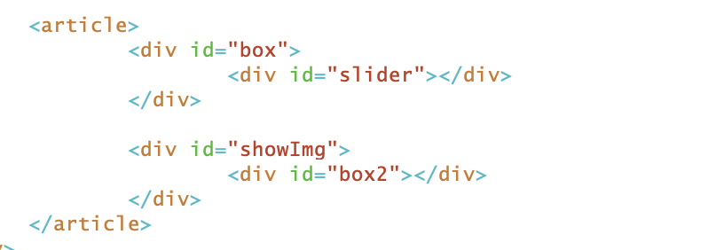
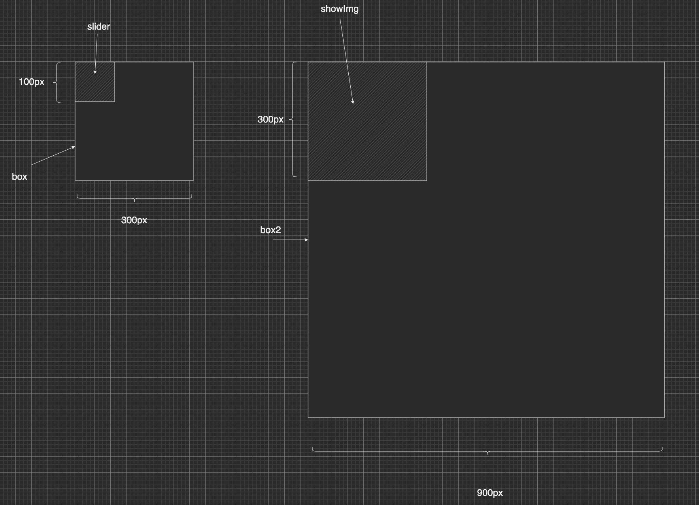
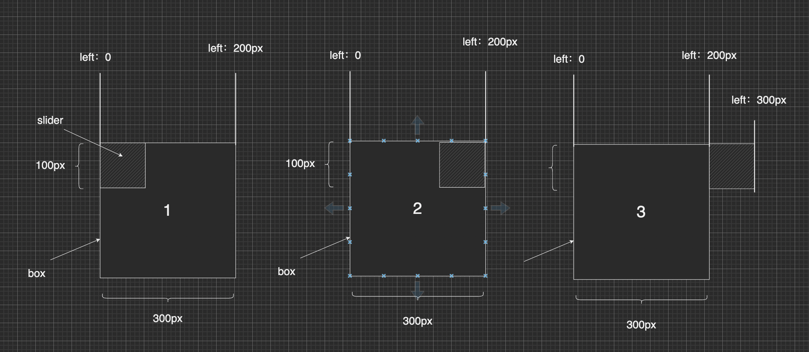

## Javascript实现放大镜

#### 1. 结构简要介绍

很多购物网站中都会有放大镜，但你知道放大镜的具体是如何实现的吗，
大多数网页中是由两个div盒子来实现放大镜的，一个盒子用作显示原图，另一个盒子用来显示前一个盒子放大的细节，具体样式可以看看下面的视频。

左边盒子是一个div(用作显示图片)里面包含一个滑块组成，右边盒子跟左边差不多，一个div包一张2显示大图片的div，
具体HTML实现如下：

先大致讲一下，放大镜的原理，读者如果读后还是有不懂，可以看一下下面的一步步的讲解，再跑一下源代码，自己尝试实现一下，
放大镜其实是由两个不同大小的div设置图像来实现，左侧为原图，右侧设置一个显示图片的区域(并设置溢出隐藏),里面是一张与原图成比例的大图，当鼠标移入左侧div时，左侧div里面的滑块跟随移动(根据事件来修改滑块的left和top),当左侧滑块移动时，计算左侧滑块移动的比例来计算右侧大图移动的left，top
具体实现参考下面。

参照上方的div布局以及草图说一下我研究放大镜过程中的一些注意事项(并不绝对,读者也可以自己改动尝试)

1. 一般box盒子的宽高与showImg一样，两块显示区域一样;

2. slider这个滑块应该与box有比例关系(设box的宽/slider的宽=v1);

3. box2的宽高可以取showImg * v1(如box取500px，slider取100px，则box2为2500px);

4. box和showImg这两个div的position属性都应该是relative;

5. slider和box2这两个div的position属性应该为absolute;

6. 由图2分析可以知道，slider的最大left为box的宽减去slider的宽,
   如果不明白的话可以看下面这张图(大佬自行跳过)，1为left为0的时候，滑块紧贴box左边，2为left为200p x的时候，滑块的右侧刚刚好抵达box右边, 对比一下3就可以发现，当滑块left为box宽时，会多出一个滑块的大小，所以left最小为0，最大为box的宽-滑块宽

   

7. 同6，box2的最大left为showImg的宽-box2的宽(该值应该是负的)，注:box2是向左靠，left为负

#### 2.  js代码实现

###### 1. 滑块移动

1.鼠标进入box时，获取pageX

事件区分

- mouseover 标记鼠标进入

- mousemove 标记鼠标在box内移动
- mouseup 标记鼠标在box内点击(鼠标点击抬起)
- mousedown 标记鼠标在box内点击(鼠标点击按下)

根据鼠标移动的pageX和pageY来设置滑块slider的left，top

* slider.style.left = e.pageX  + "px" (不太行，鼠标位于滑块左上角)
* slider.style.left = e.pageX - slider.width/2 + "px" (鼠标在slider内居中)

注:设置slider的left和top前应该判断范围
maxleftSlider = box.width-slider.width.  (slider能取的最大left)
maxtopSlider = box.height-slider.height (slider能取的最大top)
currLeft为slider当前的left

* left(0, maxleftSlider)
* top(0,maxtopSlider)

slider.style.left = currLeft < 0?0:currLeft;

slider.style.left=currLeft > maxleftSlider?maxleftSlider:currLeft;
top同上

###### 2.大图跟随移动

触发条件:当slider滑块移动时，大图也应该跟着移动，但两者的宽高不同，移动的最大left不同。
设 maxleftSlider 为slider能取的最大left，且currLeft为slider的当前left
设 maxleftBox2 为box2能取的最大left

- let v2  = currLeft / maxleftSlider (用当前的left除最大的left算出比例)
- v2 属于 [0,1]
- box2.style.left = maxleftBox2 * v2 + "px" (按照slider的left比例算出box2该移动的比例)

######  3. 总结一下

放大镜案例Javascript方面的处理大致如上，如读者还有不懂的可以先查看源码，若还是不懂的话可以联系本人。